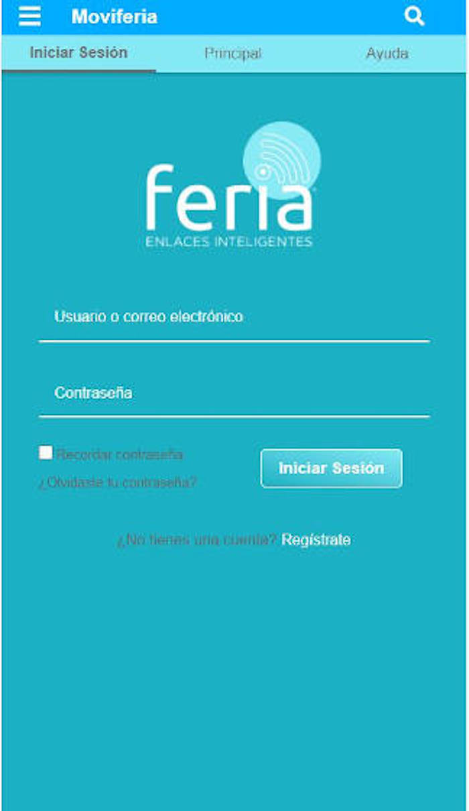

# Public Transportation App
This project tries to show the Front-end design and behavior of a mobile app, here you can navigate to different sections, search information with specific keywords, show and hide information like side-bars, questions, and answers, etc. This project was built with HTML, CSS, and JavaScript

<h2 align='center'><a href='https://transport.carlosortiz.dev/'>Check it live here</a></h2>

## Authors

- **Carlos Ortiz** - _Development_ - [CharlieOrtiz](https://github.com/CharlieOrtiz)